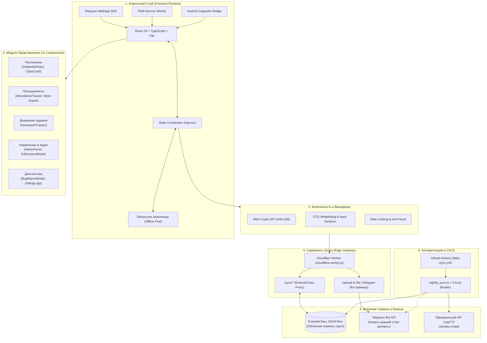

# Архитектура проекта: Расписание СамГТУ (samgtu-schedule)

Полная техническая спецификация архитектуры, структуры модулей, потоков данных, ролевой модели и механизмов отказоустойчивости.

---

## 1. Введение и Назначение Продукта (ЧТО и ДЛЯ КОГО)

### 1.1. Проблема и Цели
Студенты и старосты Самарского государственного технического университета (СамГТУ) регулярно сталкиваются с проблемами официального портала:
* Медленная загрузка и частая недоступность личного кабинета во время пиковых нагрузок (начало семестра, сессия).
* Отсутствие единого источника оперативных правок от старосты (переносы пар, смены аудиторий, отмены занятий, ссылки на созвоны).
* Сложность ведения учета посещаемости по официальным требованиям деканата (разбивка на 2 блока семестра, точный подсчет часов лекций, практик и лабораторных).
* Отсутствие оффлайн-режима.

### 1.2. Решение
**samgtu-schedule** — это автономная гибридная кроссплатформенная система:
1. **Telegram Mini App (TMA)** — основной канал для студентов (доступно в один клик прямо из Telegram без необходимости установки).
2. **Progressive Web App (PWA)** — работает в любом мобильном или десктопном браузере с поддержкой Service Worker и оффлайн-кэшированием.
3. **Android App (Capacitor)** — нативный APK для устройств без сервисов Google или Telegram.

---

## 2. Глобальная Архитектурная Схема



---

## 3. Детализация Архитектурных Слоев (ГДЕ, ЗАЧЕМ и КАК)

### Слой 1: Платформенная среда и Runtime
* **Расположение**: [`index.html`](file:///C:/Users/A.le_BL/.gemini/antigravity/scratch/samgtu-schedule/index.html), [`index.tsx`](file:///C:/Users/A.le_BL/.gemini/antigravity/scratch/samgtu-schedule/index.tsx), [`capacitor.config.json`](file:///C:/Users/A.le_BL/.gemini/antigravity/scratch/samgtu-schedule/capacitor.config.json), [`vite.config.ts`](file:///C:/Users/A.le_BL/.gemini/antigravity/scratch/samgtu-schedule/vite.config.ts).
* **Зачем**: Обеспечить нативное поведение на iOS, Android и десктопе с поддержкой темного/светлого оформления Telegram.
* **Как работает**:
  - Инициализация `window.Telegram.WebApp`: раскрытие на весь экран (`expand()`), синхронизация цветов статус-бара (`setHeaderColor`, `setBackgroundColor`), вызов виброотклика (`HapticFeedback.impactOccurred('light')`).
  - Учет `safe-area-inset`: отступы сверху/снизу динамически адаптируются под «челки» телефонов и системные шторки.
  - Поддержка оффлайна: все критические ресурсы компилируются в единый самодостаточный SPA-бандл.

---

### Слой 2: Компоненты Пользовательского Интерфейса (UI)
* **Расположение**: папка [`components/`](file:///C:/Users/A.le_BL/.gemini/antigravity/scratch/samgtu-schedule/components/) и корень [`App.tsx`](file:///C:/Users/A.le_BL/.gemini/antigravity/scratch/samgtu-schedule/App.tsx).
* **Ключевые компоненты**:
  1. [`App.tsx`](file:///C:/Users/A.le_BL/.gemini/antigravity/scratch/samgtu-schedule/App.tsx) — мастер-компонент состояния:
     - Синхронизирует активную группу, неделю цикла (1–4), выбранный день, роль пользователя.
     - Управляет фоновой двухсторонней синхронизацией с сервером.
     - Переключает основные экраны через [`BottomNav.tsx`](file:///C:/Users/A.le_BL/.gemini/antigravity/scratch/samgtu-schedule/components/BottomNav.tsx).
  2. [`SwipeableDays.tsx`](file:///C:/Users/A.le_BL/.gemini/antigravity/scratch/samgtu-schedule/components/SwipeableDays.tsx) и [`DayColumn.tsx`](file:///C:/Users/A.le_BL/.gemini/antigravity/scratch/samgtu-schedule/components/DayColumn.tsx):
     - Горизонтальный жестовый свайпер учебных дней.
     - Имеет встроенную блокировку осей (Directional Lock): вертикальный скролл страницы не сбивает свайп дня и наоборот.
  3. [`ClassCard.tsx`](file:///C:/Users/A.le_BL/.gemini/antigravity/scratch/samgtu-schedule/components/ClassCard.tsx):
     - Отображает пару: время звонков, предмет, тип (лекция/практика/лабораторная), преподавателя со званием, номер аудитории и корпус.
     - Визуальные индикаторы: «Идет прямо сейчас» (пульсирующий зеленый бейдж), «Следующая пара», «Отменена» (зачеркнуто со значком отмены), «Перенесена» (бейдж новой аудитории).
  4. [`EditLessonModal.tsx`](file:///C:/Users/A.le_BL/.gemini/antigravity/scratch/samgtu-schedule/components/EditLessonModal.tsx):
     - Модальное окно редактирования занятия для старосты/админа.
     - Позволяет отменить занятие, изменить тему, указать заменяющего преподавателя, прикрепить ссылки на материалы или трансляцию.
  5. [`AttendanceTracker.tsx`](file:///C:/Users/A.le_BL/.gemini/antigravity/scratch/samgtu-schedule/components/AttendanceTracker.tsx):
     - Учет посещаемости по студентам и парам.
     - Подсчет часов: автоматический пересчет каждой пары в 2 академических часа с разбивкой на 1-й и 2-й блоки семестра.
     - Экспорт: формирование официального отчета в формате Microsoft Word (`.docx`) через [`utils/exportWord.ts`](file:///C:/Users/A.le_BL/.gemini/antigravity/scratch/samgtu-schedule/utils/exportWord.ts).
  6. [`HomeworkTracker.tsx`](file:///C:/Users/A.le_BL/.gemini/antigravity/scratch/samgtu-schedule/components/HomeworkTracker.tsx):
     - Трекер заданий с дедлайнами, привязкой к конкретным предметам, фильтрацией по статусу («В процессе» / «Сдано»).
  7. [`BugReportModal.tsx`](file:///C:/Users/A.le_BL/.gemini/antigravity/scratch/samgtu-schedule/components/BugReportModal.tsx) и [`DebugLogsModal.tsx`](file:///C:/Users/A.le_BL/.gemini/antigravity/scratch/samgtu-schedule/components/DebugLogsModal.tsx):
     - Отправка пользовательских репортов со скриншотами и системными логами разработчику.
     - Скрытая консоль диагностики: вызывается 5-кратным быстрым тапом по заголовку приложения (доступна только администраторам).

---

### Слой 3: Бизнес-Логика Расписания и Данные
* **Расположение**: [`constants.ts`](file:///C:/Users/A.le_BL/.gemini/antigravity/scratch/samgtu-schedule/constants.ts), [`attendance.ts`](file:///C:/Users/A.le_BL/.gemini/antigravity/scratch/samgtu-schedule/attendance.ts), [`types.ts`](file:///C:/Users/A.le_BL/.gemini/antigravity/scratch/samgtu-schedule/types.ts).
* **Специфика СамГТУ**:
  - **4-недельный цикл**: в СамГТУ расписание циклично по 4 неделям (неделя 1 и 3 — нечетные, 2 и 4 — четные). Формула вычисления текущей учебной недели:
    $$\text{cycleWeek} = ((\text{currentWeekNumber} - 1) \pmod 4) + 1$$
  - **Звонки (`CALL_SCHEDULE`)**: фиксированная сетка из 7 пар (от 08:00 до 19:40).
  - **Алиасы групп**: группы имеют официальные шифры (например, `3-ИНГТ-111`, `2-ИНГТ-109`, `3-ФАИД-110`). Реестр [`constants.ts`](file:///C:/Users/A.le_BL/.gemini/antigravity/scratch/samgtu-schedule/constants.ts) содержит жестко верифицированную сетку пар для всех поддерживаемых потоков.

---

### Слой 4: Серверлесс-Шлюз и Облачная Синхронизация
* **Расположение**: [`cloudflare-worker.js`](file:///C:/Users/A.le_BL/.gemini/antigravity/scratch/samgtu-schedule/cloudflare-worker.js), [`utils/cloudSync.ts`](file:///C:/Users/A.le_BL/.gemini/antigravity/scratch/samgtu-schedule/utils/cloudSync.ts).
* **Зачем нужен Cloudflare Worker**:
  1. **Сокрытие секретов**: токен Telegram-бота и мастер-ключи хранилищ находятся в защищенных переменных окружения Cloudflare, клиенты не имеют прямого доступа к секретам.
  2. **CORS и Edge-кэширование**: решение проблем кросс-доменных запросов из Telegram WebView.
  3. **Защита от Mass Assignment и Injection**: входящие данные проходят строгий Whitelisting (разрешены только валидные поля: `customSchedule`, `homework`, `updatedAt`, `checksum`).
  4. **Rate Limiting**: защита от флуда и спам-запросов.
* **Схема синхронизации ExtendsClass**:
  - Каждая учебная группа имеет свой изолированный JSON-бин.
  - При запуске клиент делает оптимистичное чтение: сначала рендерит данные из `localStorage`, затем в фоне запрашивает свежие данные из Cloudflare Worker.
  - Если староста вносит правку, она сначала сохраняется локально, а затем отправляется в облако с вычислением контрольной суммы (`checksum`).

---

### Слой 5: Ролевая Модель и Безопасность
* **Расположение**: [`utils/auth.ts`](file:///C:/Users/A.le_BL/.gemini/antigravity/scratch/samgtu-schedule/utils/auth.ts).
* **Роли**:
  - `student` (Студент): режим по умолчанию. Чтение расписания, персональные заметки, локальный учет посещаемости.
  - `starosta` (Староста): редактирование расписания своей группы, отмена занятий, назначение аудиторий, синхронизация с облаком для всех одногруппников.
  - `admin` (Разработчик / Администратор): переключение между любыми группами, просмотр сырых диагностических логов, импорт данных из ЛК.
* **Механизм аутентификации**:
  - Валидация прав происходит через криптографические хэши **SHA-256** (Web Crypto API):
    $$\text{hash} = \text{SHA-256}(\text{PIN})$$
  - В открытом виде пароли нигде не хранятся и не передаются по сети.

---

### Слой 6: Мониторинг, Логирование и Автоматизация
* **Расположение**: [`utils/logger.ts`](file:///C:/Users/A.le_BL/.gemini/antigravity/scratch/samgtu-schedule/utils/logger.ts), [`utils/telemetry.ts`](file:///C:/Users/A.le_BL/.gemini/antigravity/scratch/samgtu-schedule/utils/telemetry.ts), [`components/ErrorBoundary.tsx`](file:///C:/Users/A.le_BL/.gemini/antigravity/scratch/samgtu-schedule/components/ErrorBoundary.tsx), [`scripts/nightly_sync.ts`](file:///C:/Users/A.le_BL/.gemini/antigravity/scratch/samgtu-schedule/scripts/nightly_sync.ts).
* **Компоненты надежности**:
  1. **In-Memory Ring Buffer**: клиент хранит последние 150 системных событий (навигация, ошибки сети, действия пользователя). При сбое лог упаковывается в репорт.
  2. **Антифлуд-телеметрия крашей**:
     - Ошибки перехватываются глобально (`window.onerror`, `unhandledrejection`).
     - Для каждой ошибки рассчитывается хэш сигнатуры.
     - Кулдаун 60 секунд: одинаковые ошибки не спамят Telegram-канал разработчика.
  3. **Двухуровневый Error Boundary**:
     - Внешний ([`ErrorBoundary.tsx`](file:///C:/Users/A.le_BL/.gemini/antigravity/scratch/samgtu-schedule/components/ErrorBoundary.tsx)) — защищает всё приложение.
     - Внутренний ([`TabErrorBoundary.tsx`](file:///C:/Users/A.le_BL/.gemini/antigravity/scratch/samgtu-schedule/components/TabErrorBoundary.tsx)) — изолирует отдельные вкладки. Если упадет рендер экспорта Word, расписание продолжит работать.
  4. **Ночная автосверка с официальным API СамГТУ**:
     - Скрипт [`nightly_sync.ts`](file:///C:/Users/A.le_BL/.gemini/antigravity/scratch/samgtu-schedule/scripts/nightly_sync.ts) запускается через GitHub Actions каждую ночь в 03:00.
     - Парсит API `samgtu.ru` для всех зарегистрированных групп.
     - При обнаружении расхождений (новые пары, переносы) отправляет отчет с диффом в Telegram и формирует обновление.
     - **Circuit Breaker**: если API университета вернул ошибку, пустой ответ или некорректный JSON, скрипт прерывает выполнение и не портит рабочую базу данных.

---

## 4. Структура Папок и Назначение Файлов

```text
samgtu-schedule/
├── .github/workflows/          # Автоматизация GitHub Actions (daily-sync.yml)
├── android/                    # Исходный код нативного Android-проекта (Capacitor)
├── components/                 # React UI-компоненты
│   ├── AdminPanel.tsx          # Панель управления группами и расписанием
│   ├── AttendanceTracker.tsx   # Журнал посещаемости и расчет часов
│   ├── BottomNav.tsx           # Нижняя навигационная панель (Табы)
│   ├── BugReportModal.tsx      # Модальное окно отправки баг-репортов
│   ├── ClassCard.tsx           # Карточка пары со статусами и стилями
│   ├── DayColumn.tsx           # Колонка одного учебного дня
│   ├── DebugLogsModal.tsx      # Консоль просмотра логов (5 тапов)
│   ├── EditLessonModal.tsx     # Модалка редактирования пары старостой
│   ├── ErrorBoundary.tsx       # Корневой перехватчик сбоев React
│   ├── GroupManager.tsx        # Селектор и переключатель групп
│   ├── HomeworkTracker.tsx     # Трекер домашних заданий
│   ├── ScheduleImportModal.tsx # Импорт расписания из ЛК СамГТУ
│   ├── SubjectTeachersModal.tsx# Список преподавателей по предметам
│   ├── SwipeableDays.tsx       # Свайпер дней недели с Directional Lock
│   └── TabErrorBoundary.tsx    # Локальный перехватчик сбоев внутри табов
├── utils/                      # Утилиты и сервисные модули
│   ├── auth.ts                 # Хэширование SHA-256 и проверка PIN
│   ├── cloudSync.ts            # Клиент синхронизации с Cloudflare Worker
│   ├── exportWord.ts           # Генерация официальных ведомостей в .docx
│   ├── logger.ts               # Кольцевой буфер системных логов
│   ├── samgtuGroupMap.ts       # Маппинг ID групп СамГТУ
│   ├── samgtuParser.ts         # Парсер расписания официального API СамГТУ
│   └── telemetry.ts            # Автоматическая отправка алертов крашей
├── scripts/                    # Серверные скрипты и парсеры
│   ├── nightly_sync.ts         # Ночной робот сверки расписания
│   ├── sync_official_schedule.ts # Ручная синхронизация базы с API
│   └── update_faid_teachers.ts # Обновление преподавателей ФАИД
├── tests/                      # Комплекс автоматических тестов (39 сьютов)
│   ├── run_all.ts              # Мастер-раннер тестов
│   ├── test_auth_hashes.ts     # Проверка криптографии PIN-кодов
│   ├── test_sanitization.ts    # Тесты защиты от Mass Assignment
│   └── test_telemetry.ts       # Тесты телеметрии и дедупликации крашей
├── App.tsx                     # Корневой координатор приложения
├── attendance.ts               # Логика и математика учета посещаемости
├── cloudflare-worker.js        # Пограничный микросервис Cloudflare Worker
├── constants.ts                # Реестр расписания (SCHEDULE_REGISTRY, звонки)
├── types.ts                    # Типы данных TypeScript
├── index.html                  # Главный HTML-контейнер
├── index.tsx                   # Точка входа React 19
├── vite.config.ts              # Конфигурация сборщика Vite
└── package.json                # Зависимости и скрипты сборки
```

---

## 5. Жизненный Цикл Данных (Data Flow)

### Сценарий: Открытие приложения студентом
1. Приложение стартует в среде Telegram WebView.
2. `index.tsx` монтирует `<App />`, обернутый в `<ErrorBoundary>`.
3. `App.tsx` синхронно считывает `localStorage`:
   - Выбранная группа (`selectedGroup`).
   - Кэш локальных правок расписания (`customSchedule`).
   - Настройки темы и роль (`role`).
4. Интерфейс рендерится мгновенно (0 мс задержки сети, оффлайн-готовность).
5. Параллельно запускается `useEffect` с фоновой задачей `loadCloud(groupId)`:
   - Запрос уходит на `Cloudflare Worker`.
   - Worker обращается к `ExtendsClass`.
   - При получении новых данных происходит мягкое слияние (`mergeSchedules`), не сбрасывающее текущее состояние скролла.

### Сценарий: Редактирование пары старостой
1. Староста нажимает на пару -> открывается `EditLessonModal.tsx`.
2. Староста выбирает статус «Пара отменена» или меняет аудиторию -> нажимает «Сохранить».
3. Проверяются права: `role === 'starosta' || role === 'admin'`.
4. Новое состояние немедленно записывается в `localStorage`.
5. `ClassCard.tsx` моментально обновляет свой вид (оптимистичный UI).
6. В фоне `cloudSync.ts` отправляет валидированный DTO через `Cloudflare Worker` в облачную корзину группы.
7. Все студенты этой группы при следующем открытии приложения или по таймеру получают обновленное расписание.

### Сценарий: Критический сбой (Runtime Crash)
1. В каком-либо компоненте происходит непредвиденная ошибка (например, сбой парсинга нестандартной даты).
2. Ошибку перехватывает ближайший `TabErrorBoundary` или корневой `ErrorBoundary`.
3. Пользователю выводится аккуратный экран ошибки с кнопкой «Перезагрузить» (белый экран смерти исключен).
4. `telemetry.ts` формирует аварийный пакет:
   - Сообщение и Stack Trace ошибки.
   - Метаданные (версия приложения, User-Agent, платформа Telegram, текущая группа).
   - Последние 30 строк из `logger.ts`.
5. Пакет отправляется через `Cloudflare Worker (/upload)` в служебный Telegram-чат разработчика.

---

## 6. Резюме архитектурных преимуществ
* **100% Offline First**: приложение полноценно работает без интернета в бункерах и подвальных аудиториях.
* **Нулевая стоимость инфраструктуры**: бесплатные тарифные планы Cloudflare Workers и ExtendsClass с запасом покрывают нагрузку потоков университета.
* **Высокая отказоустойчивость**: двухуровневые Error Boundaries, Circuit Breaker в парсерах, антифлуд в телеметрии.
* **Безопасность корпоративного уровня**: сокрытие токенов, Web Crypto SHA-256, DTO Whitelisting.
