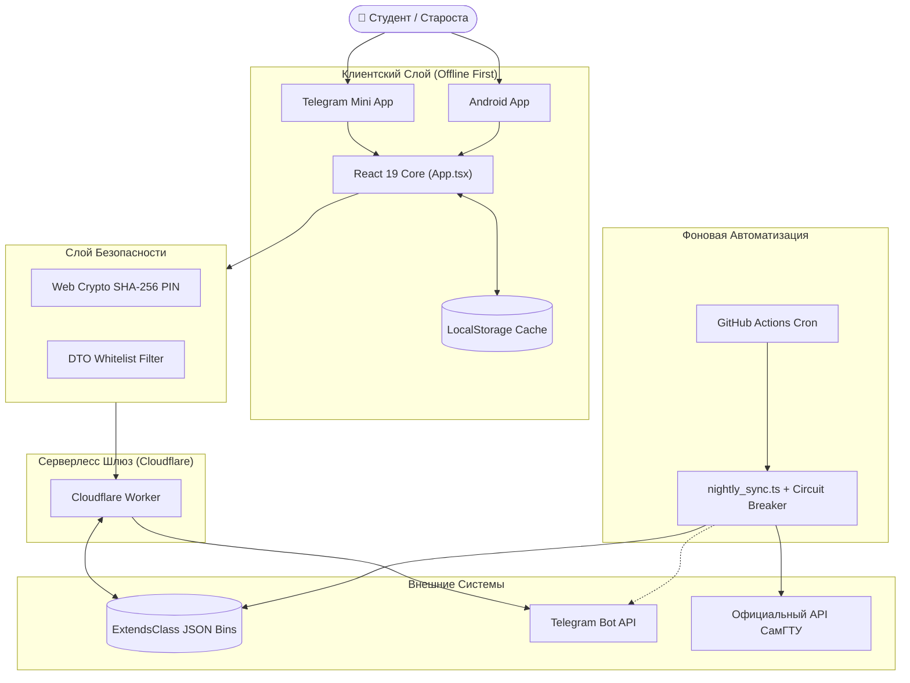

# 🎓 Расписание СамГТУ: Карта Знаний Хранилища

Добро пожаловать в интерактивное хранилище архитектуры, компонентов и проектных решений системы **samgtu-schedule**.

Данное хранилище представляет собой цифровую базу знаний (Digital Garden), где каждый модуль, архитектурное решение (ADR) и поток данных связаны гиперссылками (Wikilinks), формируя интерактивный граф связей в Obsidian.

---

## 🧭 Глобальная Навигация по Разделам

### 1. Архитектурные Слои
* [[Слой 1 - Клиентский Слой и Runtime]] — Telegram WebApp SDK, PWA Service Worker, Android Capacitor Bridge.
* [[Слой 2 - Компоненты Пользовательского Интерфейса]] — React 19 UI-компоненты, адаптивность и жесты.
* [[Слой 3 - Расписание и Бизнес-Ядро]] — 4-недельный цикл СамГТУ, сетка звонков, расчет академических часов.
* [[Слой 4 - Серверлесс Шлюз и Edge]] — Cloudflare Worker: сокрытие секретов, CORS, Whitelisting.
* [[Слой 5 - Облачная Синхронизация]] — ExtendsClass JSON Bins, мягкое слияние и оптимистичный UI.
* [[Слой 6 - Безопасность и Ролевая Модель]] — Web Crypto SHA-256 хэширование PIN-кодов старост и админа.
* [[Слой 7 - Телеметрия и Сигнализация Сбоев]] — Кольцевой буфер (Ring Buffer) на 150 логов, антифлуд и Telegram-алерты.
* [[Слой 8 - Автоматизация и Ночная Автосверка]] — Ночной робот, API СамГТУ, Circuit Breaker, GitHub Actions.

### 2. Архитектурные Решения (ADR) — Почему сделан такой выбор
* [[ADR-001 - Cloudflare Worker и JSON Bins вместо VPS]] — Почему мы не арендуем сервер и не пишем традиционный бэкенд на Node.js/PostgreSQL.
* [[ADR-002 - Offline First и 4-недельный цикл расписания]] — Почему локальный кэш первичен, а расписание зашито в клиентский реестр.
* [[ADR-003 - SHA-256 PIN аутентификация старост]] — Почему старостам не нужна регистрация с логинами и SMS-кодами.
* [[ADR-004 - Тройной рантайм (TMA + PWA + Capacitor)]] — Как мы покрываем 100% устройств (iOS, Android, десктоп) без троекратной разработки.
* [[ADR-005 - Whitelisting и защита от Mass Assignment]] — Как Cloudflare Worker фильтрует входящие JSON-пакеты.
* [[ADR-006 - Circuit Breaker в ночном парсере СамГТУ]] — Как защита от падений сервера СамГТУ спасает от затирания рабочей базы.

### 3. Модули и Компоненты (Deep Dive)
* [[App.tsx - Главный Оркестратор Приложения]]
* [[ClassCard.tsx - Карточка Занятия]]
* [[SwipeableDays.tsx - Жестовый Свайпер]]
* [[EditLessonModal.tsx - Редактирование Старосты]]
* [[AttendanceTracker.tsx - Журнал Посещаемости]]
* [[HomeworkTracker.tsx - Задачник и Дедлайны]]
* [[BugReportModal.tsx и DebugLogsModal.tsx]]
* [[ErrorBoundary.tsx и TabErrorBoundary.tsx]]
* [[constants.ts и types.ts - Реестр и Типизация]]
* [[cloudflare-worker.js - Пограничный Шлюз]]
* [[cloudSync.ts - Клиент Облачной Синхронизации]]
* [[auth.ts - Криптография и Роли]]
* [[logger.ts и telemetry.ts - Диагностика и Логи]]
* [[samgtuParser.ts и nightly_sync.ts - Парсер СамГТУ]]
* [[exportWord.ts - Генерация Ведомостей Word]]

### 4. Потоки Данных (Data Flows & Sequences)
* [[Поток 1 - Инициализация и Холодный Старт]]
* [[Поток 2 - Внесение Правок Старостой и Синхронизация]]
* [[Поток 3 - Обработка Сбоев и Телеметрия в Telegram]]
* [[Поток 4 - Ночная Сверка с API СамГТУ]]
* [[Поток 5 - Учет Посещаемости и Экспорт в DOCX]]

### 5. Контроль Качества и Надежность
* [[Комплекс Автоматических Тестов]] — 39 сьютов тестов регрессии, санитизации и парсинга.
* [[Глоссарий и Терминология]] — Справочник терминов СамГТУ и веб-технологий.
* [[Архитектурный Граф]] — Карта связей и кластеров базы знаний.

### 6. Дорожная Карта и Развитие
* [[Дорожная Карта Проекта]] — Краткая и полная дорожная карта: масштабирование на 100+ групп СамГТУ, Telegram-уведомления об отменах, экспорт в iCal/Google Calendar, карта корпусов и оптимизация бандла.

---

## 📊 Системная Архитектурная Диаграмма

