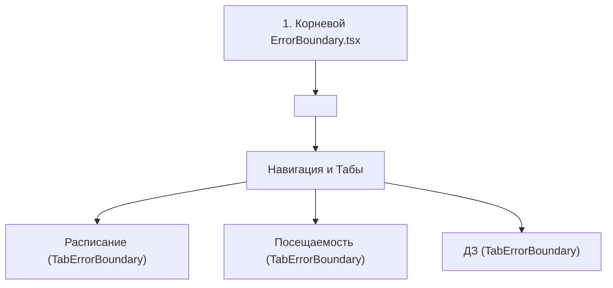

# 🛡️ ErrorBoundary.tsx и TabErrorBoundary.tsx: Двухуровневая Защита от Сбоев

## 1. За что отвечает
React по умолчанию при возникновении необработанного исключения в любом компоненте полностью размонтирует всё дерево приложения, оставляя пользователя перед пустым белым экраном («White Screen of Death»).
Для исключения таких ситуаций в проекте реализована **двухуровневая система Error Boundary**:

## 2. Уровни защиты
1. **Корневой `ErrorBoundary.tsx`**:
   Оборачивает всё приложение. Если произойдет фатальный сбой в корне, пользователю покажется дружелюбный экран ошибки с кнопкой «Перезагрузить приложение» и кнопкой «Отправить отчет разработчику».
2. **Вкладочный `TabErrorBoundary.tsx`**:
   Изолирует каждую вкладку отдельно. Если при формировании таблицы посещаемости произойдет сбой данных, упадет только вкладка посещаемости. Вкладка расписания продолжит работать безупречно.
3. **Автоматический алерт**:
   При каждом перехвате ошибки автоматически вызывается `reportErrorToTelegram` из [[logger.ts и telemetry.ts - Диагностика и Логи]].

---
## 🔗 Связанные материалы
* Слой: [[Слой 7 - Телеметрия и Сигнализация Сбоев]]
* Телеметрия: [[logger.ts и telemetry.ts - Диагностика и Логи]]
