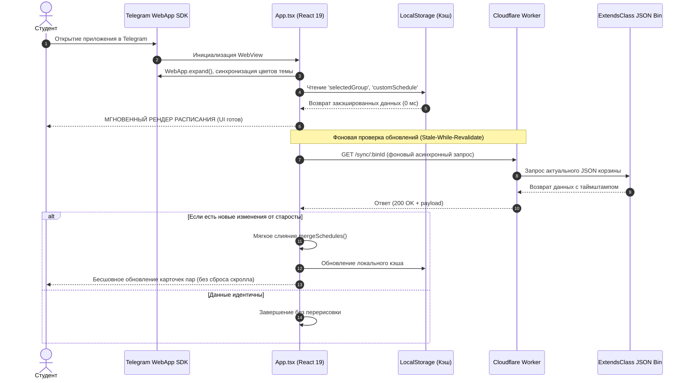

# ⚡ Поток 1: Инициализация и Холодный Старт Приложения

## Диаграмма Последовательности (Sequence Diagram)

## Подробный разбор шагов
1. **Запуск**: Студент кликает по ссылке или кнопке бота в Telegram.
2. **Инициализация SDK**: React проверяет глобальный объект `window.Telegram.WebApp`, раскрывает приложение на 100% высоты экрана и устанавливает безопасные отступы.
3. **Чтение кэша**: Синхронный запрос к `localStorage` возвращает расписание группы. Экран отрисовывается за 0 миллисекунд.
4. **Фоновый синк**: В фоновом режиме уходит запрос к [[cloudflare-worker.js - Пограничный Шлюз]]. Если староста внес правки, они мягко встраиваются в интерфейс.

---
## 🔗 Связанные материалы
* Компонент: [[App.tsx - Главный Оркестратор Приложения]]
* Обоснование: [[ADR-002 - Offline First и 4-недельный цикл расписания]]
