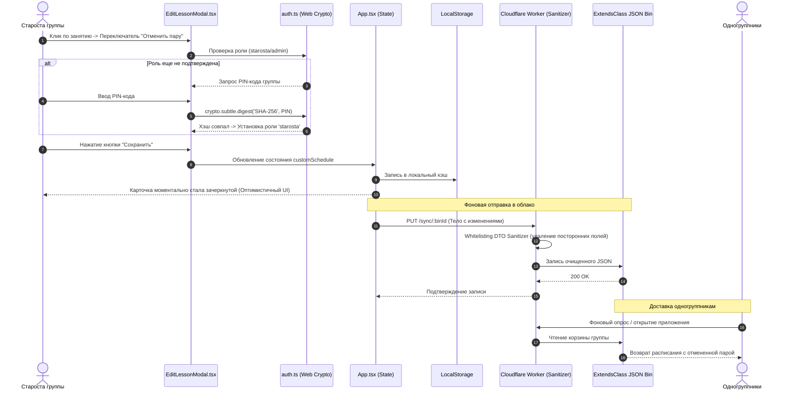

# ✏️ Поток 2: Внесение Правок Старостой и Синхронизация

## Диаграмма Потока Данных

## Ключевые принципы надежности
* **Оптимистичный интерфейс**: Староста не ждет ответа облака. Карточка меняется сразу.
* **Фильтрация DTO**: Cloudflare Worker гарантирует, что в базу попадает только валидный объект расписания.

---
## 🔗 Связанные материалы
* Модуль: [[EditLessonModal.tsx - Редактирование Старосты]]
* Шлюз: [[cloudflare-worker.js - Пограничный Шлюз]]
* Обоснование: [[ADR-005 - Whitelisting и защита от Mass Assignment]]
