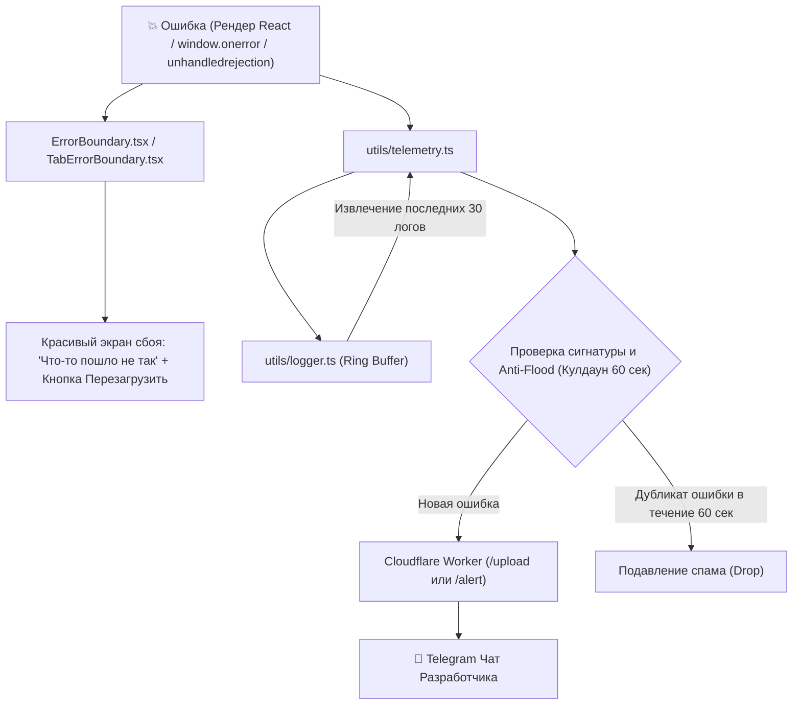

# 🚨 Поток 3: Обработка Сбоев и Сигнализация в Telegram

## Архитектура Сигнализации



## Содержимое Аварийного Пакета
При возникновении сбоя разработчик получает в Telegram сообщение следующего формата:
```text
🚨 [CRASH ALERT] samgtu-schedule
Ошибка: Cannot read properties of undefined (reading 'lessons')
Файл: components/DayColumn.tsx:42
Платформа: Telegram WebApp (iOS 17.5 / iPhone 15 Pro)
Группа: 3-ИНГТ-111 | Неделя: 2 | День: Вторник

Последние системные логи:
[14:02:11] [INFO] Selected group changed: 3-ИНГТ-111
[14:02:12] [INFO] Cloud sync requested
[14:02:12] [WARN] ExtendsClass payload empty, using fallback
[14:02:13] [ERROR] Render failed in DayColumn
```

---
## 🔗 Связанные материалы
* Слой: [[Слой 7 - Телеметрия и Сигнализация Сбоев]]
* Модули: [[logger.ts и telemetry.ts - Диагностика и Логи]]
