# 📄 Поток 5: Учет Посещаемости и Клиентский Экспорт в DOCX

## Архитектура Генерации Документа Word

```mermaid
flowchart LR
    Starosta["Староста в AttendanceTracker.tsx"]
    Matrix["Матрица отметок присутствия (Н/У/Присутствовал)"]
    Calculator["Математический калькулятор (attendance.ts)"]
    
    DocxLib["Библиотека docx (Client-side engine)"]
    Blob["Сформированный бинарный Blob (.docx)"]
    Download["📥 Скачивание файла в браузере"]
    
    Starosta --> Matrix
    Matrix --> Calculator
    Calculator -->|Расчет часов по блоку 1 и блоку 2| DocxLib
    DocxLib -->|Компиляция XML-структур Word| Blob
    Blob --> Download
```

## Преимущества клиентской генерации
* Документ собирается прямо в браузере старосты за 200 миллисекунд.
* Никакие персональные данные студентов (списки группы, фамилии) не отправляются на сторонние серверы, что обеспечивает 100% конфиденциальность в соответствии с законодательством.

---
## 🔗 Связанные материалы
* Модуль: [[AttendanceTracker.tsx - Журнал Посещаемости]]
* Генератор: [[exportWord.ts - Генерация Ведомостей Word]]
